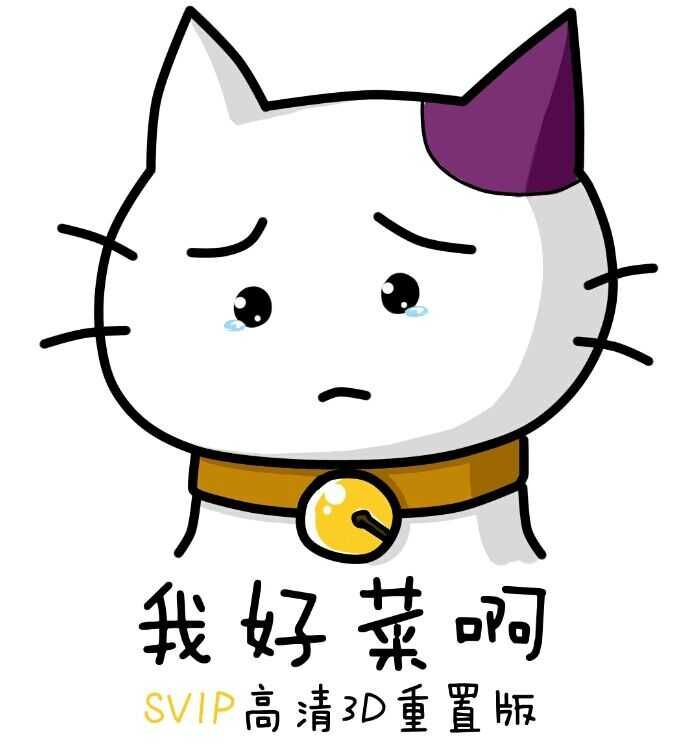

##  关于我自己

嗨呀，我好菜呀！有什么可说的呢。。。

看过太多同龄的大神，体会过各种被碾压得成渣渣的感觉，其中有来自某看着成长起来的[小学生](https://github.com/qiaozhanrong) (虽然截止现在-2016-已经初中了)，在各种博客中随时能发现随手就能碾压我的各种初高中生博主。

受到了有来自无节操赛艇群里各路 dalao 的鼓励，同时也让我默默献上了膝盖。。。

喜欢二次元，天天看着群里 dalao 穿女装、开车，不敢说话。。。受到[某老司机](http://www.saber.我爱你/tag/hentai)的影响，所以自己也想建个车库（咳，我只是说文件应该整理对不对！）

各方面都是辣鸡，但是觉得好玩就不会放弃。

###  关于编程

蒟蒻。。。各种意义上都是弱鸡。。。能和各位 蒟苣 dalao 生活在同一个时代真是了不起。

喜欢 C#，热爱玩 Python。因为觉得 C# 代码优美，逻辑关系明确，写的时候很舒服；用 Python 是因为喜欢脚本语言的便捷性，但是一直都吐槽动态语言的各种不爽，Python 学到后面各种黑科技黑魔法，总看到有 dalao 写的代码把我认为应该是 Python 设计不合理的地方当特性玩得飞起，卧槽，谁说 Python 简单来着！

话说回来，shell 和 js 这种丧心病狂、自带混淆、又不得不用的语言，让我还是对 Python 感到别无所求了 (毕竟好那么多是不是)。

写页面向来无视浏览器兼容性，有各种写出失败且不可调试代码的丰富经历。

### 背景图包

本站背景图片均来自网络，因个人喜好所以设为背景，不作商用，部分尚不明出处，绝大部分来自于我所喜爱的几位 [P 站](http://www.pixiv.net/) 画师，此处向各位大触们再次献上膝盖：（以下列举尚不完整~）

[【wlop】](http://www.pixiv.net/member.php?id=2188232)    [【千夜QYS3】](http://www.pixiv.net/member.php?id=7210261)  [【白夜ReKi】](http://www.pixiv.net/member.php?id=10606052)  [【KyoD＋@ミクラブ】](http://www.pixiv.net/member.php?id=7640889)  [【小忍.pr】](http://www.pixiv.net/member.php?id=12793879)  [【ASK】](http://www.pixiv.net/member.php?id=1980643)  [【Cait】](http://www.pixiv.net/member.php?id=573302) 

### 业余爱好

喜欢写字，喜欢弹钢琴 (虽然我只有手卷琴~)，喜欢画老婆~~

不过还 too young, too naive ! 还需要再学习一个。

也喜欢古文，比如我就念了一句诗：

​      苟利国家生死以 。。。

### 最后

放一张齐神的嫌弃脸 - (我跟你讲我就这个表情！) 

